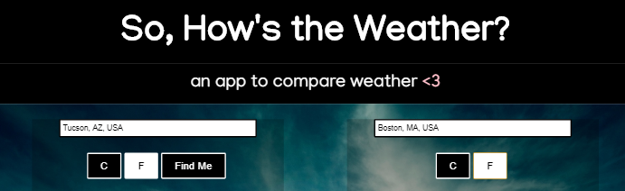
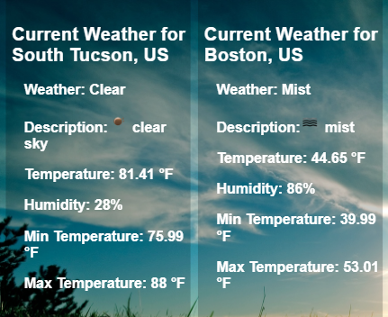

https://nicole919.github.io/weather/

So How's the Weather?

An app to compare weather in two different locations side by side.

## Motivation

I wanted to be able to see the weather in my location and easily compare it current weather globally.

## Technology Used

HTML / CSS / Javascript / JQuery
